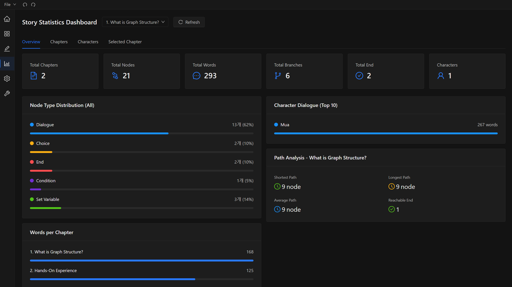
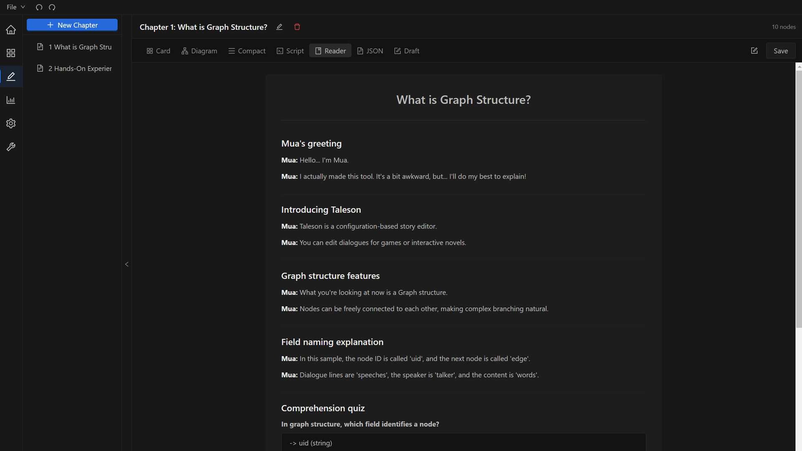
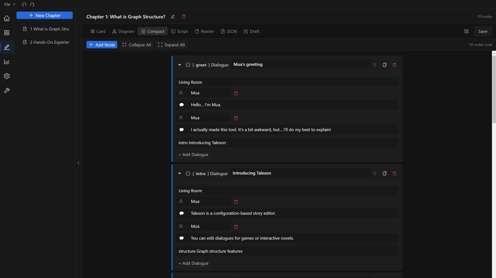
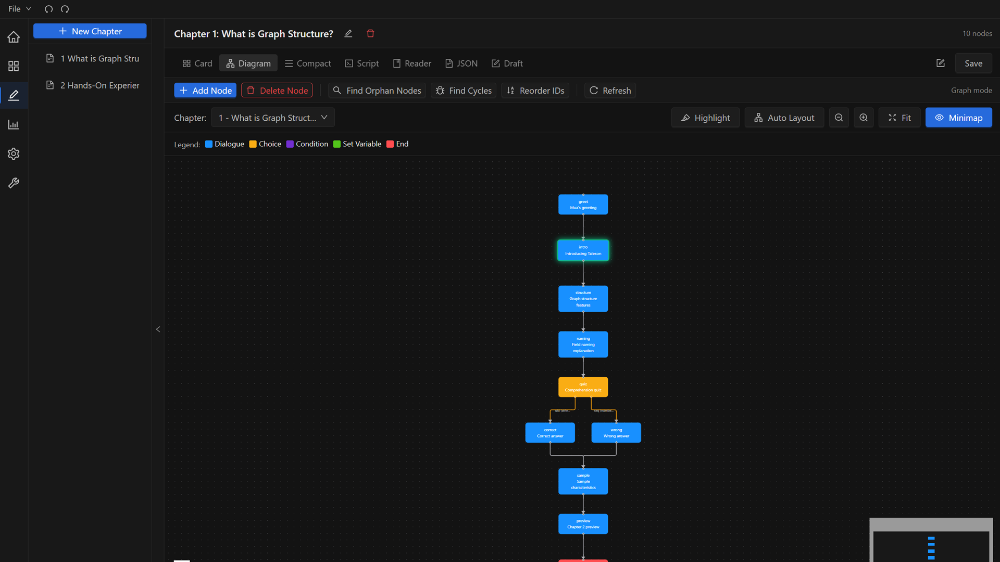
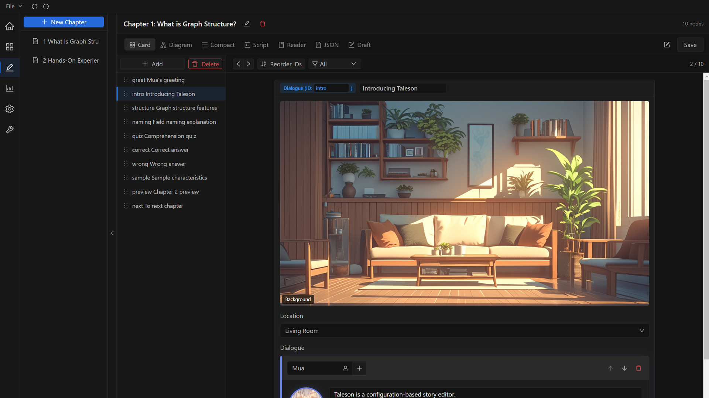

# Taleson

**게임용 JSON 스토리를 쉽게 만드는 에디터**

코딩 없이 스토리를 쓰고, 장면을 연결하고, 바로 내보내세요.

[English](README.md) | [日本語](README.ja.md) | [中文](README.zh.md)

---

> **이 버전은 무료 데모입니다.** 일부 기능에 제한이 있습니다. [Steam](https://store.steampowered.com/app/4507640/)에서 정식 버전을 찜하고 출시 알림을 받으세요.

## Taleson이란?

Taleson은 JSON 데이터로 구조화된 스토리를 작성하기 위한 데스크톱 애플리케이션입니다. 비주얼 노벨, 분기형 RPG 대화, 복잡한 인터랙티브 내러티브 등 어떤 스토리든 체계적으로 구성하고, 시각화하고, 내보낼 수 있습니다.

프로젝트의 모든 요소는 **설정 기반**으로 동작합니다. 컬럼 레이아웃, 노드 타입, 필드 동작 모두 프로젝트 설정으로 정의됩니다.

## 스크린샷

| 대시보드 | 리더 뷰 |
|:-------:|:-------:|
|  |  |

| 컴팩트 에디터 | 다이어그램 뷰 |
|:-----------:|:----------:|
|  |  |

| 카드 에디터 |
|:----------:|
|  |

## 주요 기능

### 스토리 구조

| 모드 | 설명 | 적합한 용도 |
|------|------|------------|
| **Array** | 선형, 순차적 노드 | 단순 스크립트, 튜토리얼 |
| **Graph** | 분기형 노드 트리 | RPG 대화, 선택지 기반 내러티브 |
| **Graph-Inline** | 인라인 자식 노드가 있는 그래프 | 비주얼 노벨, 대화 중심 스토리 |

### 에디터

- 7가지 편집 뷰: 카드, 컴팩트, 다이어그램, 스크립트, 리더, JSON, 드래프트
- 드래그 앤 드롭 비주얼 노드 에디터
- 조건 분기 (변수, 연산자, 값)
- 노드 타입 시스템 (대화, 선택지, 조건, 변수, 엔딩, 커스텀 타입)
- 프로젝트별 커스터마이즈 가능한 컬럼과 필드
- 스토리 통계 대시보드

### 내보내기

- HTML 내보내기 (독립 실행형 리딩)
- JSON 데이터 (게임 엔진 연동)

### AI 연동 (MCP)

- 내장 MCP (Model Context Protocol) 서버
- AI 에이전트가 스토리 노드를 읽고, 생성하고, 수정 가능
- 22개 이상의 AI 도구 호환 (Claude, Cursor, Windsurf, Copilot, JetBrains 등)

### 다국어 지원

- 4개 언어 UI 완벽 지원: 영어, 한국어, 일본어, 중국어(간체)
- 언어별 8개 프로젝트 템플릿

## 데모 제한 사항

| 기능 | 데모 | 정식 버전 |
|------|------|----------|
| 챕터 | 2개 | 무제한 |
| 챕터당 노드 | 10개 | 무제한 |
| 노드당 대사 | 15개 | 무제한 |
| 변수 | 3개 | 무제한 |
| 타입별 리소스 | 3개 | 무제한 |

## 다운로드

[**Releases**](https://github.com/Taleson/Taleson/releases/latest) 페이지에서 데모를 다운로드하세요.

| 플랫폼 | 형식 |
|--------|------|
| Windows | `.exe` 설치파일 / 포터블 |

## 게임 엔진 연동 계획

| 엔진 | 상태 |
|------|------|
| RPG Maker MV/MZ | 예정 |
| Ren'Py | 예정 |
| Ink (Unity) | 예정 |
| Yarn Spinner (Unity) | 예정 |

## 피드백 & 커뮤니티

여러분의 의견을 기다립니다:

- **버그 제보** -- [이슈 등록](https://github.com/Taleson/Taleson/issues/new?template=bug_report.md)
- **기능 요청** -- [이슈 등록](https://github.com/Taleson/Taleson/issues/new?template=feature_request.md)
- **자유 토론** -- [Discussions 참여](https://github.com/Taleson/Taleson/discussions)

## 라이선스

Copyright (c) 2025-2026 Taleson. All rights reserved.

이 소프트웨어는 독점 소프트웨어입니다. 저자의 사전 서면 허가 없이 이 소프트웨어를 복사, 수정, 배포 또는 사용하는 것은 엄격히 금지됩니다.

자세한 내용은 [LICENSE](LICENSE)를 참조하세요.
